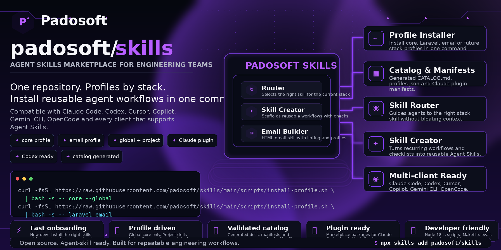

<p align="center">
  
</p>

# padosoft/skills

**Agent Skills for engineering teams: one repository, profiles by stack, installation in a single command.**

[](https://github.com/padosoft/skills/actions/workflows/ci.yml)
[](https://agentskills.io/specification)
[](LICENSE)
[](https://www.python.org/)
[](https://skills.sh/padosoft/skills)

Skills compatible with Claude Code, Codex, Cursor, Copilot, Gemini CLI, OpenCode and every other client that
supports the [Agent Skills](https://agentskills.io) format.

The full list of skills — what they do, when they trigger and where they get installed — is further down:
[**Available skills**](#available-skills). The per-profile table lives in [CATALOG.md](CATALOG.md).

**Install from the directory** — the repo is listed in the Agent Skills directory at
[skills.sh/padosoft/skills](https://skills.sh/padosoft/skills): `npx skills add padosoft/skills --list` shows
what is inside, `--skill <name>` installs just one. Profiles (below) stay the recommended route.

---

## New here? Start with this

```bash
# 1. the cross-project skills, valid on every project (few of them, to keep context light)
curl -fsSL https://raw.githubusercontent.com/padosoft/skills/main/scripts/install-profile.sh | bash -s -- core --global

# 2. the stack of the project you are working on (from the project folder)
curl -fsSL https://raw.githubusercontent.com/padosoft/skills/main/scripts/install-profile.sh | bash -s -- api devops
```

The `core` profile installs four cross-project skills: **the router**, which from then on tells you by itself
which skills are missing for the project you open, **the skill creator**, for when you want to add a new one,
**commit integrity**, which checks that what git recorded is what you changed, and **logging discipline**,
which is what must never reach a log line or a user's screen. If you do not know which profile you need, install `core` and ask the agent.

Windows (PowerShell):

```powershell
irm https://raw.githubusercontent.com/padosoft/skills/main/scripts/install-profile.ps1 | iex
Install-PadosoftSkills core -Global
```

## Available skills

<!-- SKILLS:START - generated by scripts/build_catalog.py, do not edit by hand -->

_12 skills in the catalog. Section generated from the frontmatter: refresh it with `make catalog`._

| Skill | Profiles | Scope | Version |
|---|---|---|---|
| [`padosoft-git-commit-integrity`](#git-commit-integrity) | core | global | 0.1.0 |
| [`padosoft-logging-discipline`](#logging-discipline) | core | global | 0.1.0 |
| [`padosoft-skill-creator`](#skill-creator) | core | global | 0.1.0 |
| [`padosoft-skills-router`](#skills-router) | core | global | 0.1.0 |
| [`padosoft-api-security-review`](#api-security-review) | api, node | project | 0.1.0 |
| [`padosoft-email-html-builder`](#email-html-builder) | email | project | 1.1.0 |
| [`padosoft-hono-api-conventions`](#hono-api-conventions) | node, api | project | 0.1.0 |
| [`padosoft-mobile-security-review`](#mobile-security-review) | react-native | project | 0.1.0 |
| [`padosoft-openapi-spec-workflow`](#openapi-spec-workflow) | api, node | project | 0.1.0 |
| [`padosoft-pr-review-triage`](#pr-review-triage) | devops | project | 0.1.0 |
| [`padosoft-react-native-conventions`](#react-native-conventions) | react-native | project | 0.1.0 |
| [`padosoft-rn-screen-scaffolding`](#rn-screen-scaffolding) | react-native | project | 0.1.0 |

### git-commit-integrity

**`padosoft-git-commit-integrity`** · profiles: `core` · scope: `global` · version: 0.1.0

**Triggers when** — Use this skill right after committing, and whenever something that works locally is missing or wrong everywhere else: a file you are certain you added is not in the repository, CI cannot find a module that exists on your machine, a colleague gets a whole-file diff from a one-line change, a review shows changes nobody made, or a generated file keeps coming back modified. It verifies what git actually recorded — `git add -A` skips ignored files in silence, and without a .gitattributes the line endings of whoever committed end up in the index — and gives the correct fix for each, which is never `git add -f`. Do not use it for merge conflicts, rebasing, branch strategy, or writing commit messages.

**Where it goes** — installed **globally** with the `core` profile: it applies to every project. Folder: [`skills/padosoft-git-commit-integrity`](skills/padosoft-git-commit-integrity).

```bash
npx skills add https://github.com/padosoft/skills/tree/main/skills/padosoft-git-commit-integrity
```

### logging-discipline

**`padosoft-logging-discipline`** · profiles: `core` · scope: `global` · version: 0.1.0

**Triggers when** — Use this skill whenever code writes to a log or builds an error message for a user — a catch block, an exception handler, a logger call, telemetry, a debug line added while hunting a bug — and whenever the user says a log is noisy or useless, an error message shows SQL or a stack trace, a support ticket contains data it should not, or asks what is safe to log. It gives what must never reach a log or a screen, what to keep so the log stays diagnosable, and where the redaction goes in each stack, which is not the same place. Do not use it to choose a logging library or to configure log shipping, retention or dashboards.

**Where it goes** — installed **globally** with the `core` profile: it applies to every project. Folder: [`skills/padosoft-logging-discipline`](skills/padosoft-logging-discipline).

```bash
npx skills add https://github.com/padosoft/skills/tree/main/skills/padosoft-logging-discipline
```

### skill-creator

**`padosoft-skill-creator`** · profiles: `core` · scope: `global` · version: 0.1.0

**Triggers when** — Use this skill when creating, editing or reviewing an Agent Skill of the padosoft/skills repository, when the user wants to turn a recurring workflow, a checklist or a set of guidelines into a reusable skill, or when they ask where a skill belongs (profile, scope, package) or why the repo CI is failing on catalog, profiles or manifests: it guides the whole creation with scaffolding, the Padosoft conventions and the automated checks. Do not use it to write the technical domain content (that is the job of the skill you are creating) nor to install existing skills (padosoft-skills-router handles that).

**Where it goes** — installed **globally** with the `core` profile: it applies to every project. Folder: [`skills/padosoft-skill-creator`](skills/padosoft-skill-creator).

```bash
npx skills add https://github.com/padosoft/skills/tree/main/skills/padosoft-skill-creator
```

### skills-router

**`padosoft-skills-router`** · profiles: `core` · scope: `global` · version: 0.1.0

**Triggers when** — Use this skill when the user asks which Padosoft skills exist, which ones to install for the current project or stack, or how to update or remove them, and also when you are about to work on a company stack (Laravel, Node/Hono/Workers, React Native/Expo, HTML email, API, payments) and no skill covering that stack is installed: it points to the right skill and gives the exact install command. It does not replace the stack skills and does not do their technical work for them.

**Where it goes** — installed **globally** with the `core` profile: it applies to every project. Folder: [`skills/padosoft-skills-router`](skills/padosoft-skills-router).

```bash
npx skills add https://github.com/padosoft/skills/tree/main/skills/padosoft-skills-router
```

### api-security-review

**`padosoft-api-security-review`** · profiles: `api`, `node` · scope: `project` · version: 0.1.0

**Triggers when** — Use this skill before committing or reviewing any change to an HTTP API that touches routing, auth middleware, settings or config endpoints, logging and telemetry, SQL, error handling, response shaping, client IP, rate limits or an outbound fetch — and whenever the user asks for a security review, an audit, or says an endpoint "seems public", "returns too much" or "leaks something": it runs ten checks with ready grep pre-screens (auth on every mutating route, ownership from the authenticated id, no secrets or PII in responses, bound SQL, fail-safe env gates, resource caps, redacted logs, downstream injection, no trust from caller input, supply chain) and blocks the commit on each violation. Do not use it for infrastructure hardening (WAF, DNS, firewall) or for dependency CVE triage.

**Where it goes** — installed **in the project** that needs it, not globally. Folder: [`skills/padosoft-api-security-review`](skills/padosoft-api-security-review).

```bash
npx skills add https://github.com/padosoft/skills/tree/main/skills/padosoft-api-security-review
```

### email-html-builder

**`padosoft-email-html-builder`** · profiles: `email` · scope: `project` · version: 1.1.0

**Triggers when** — Use this skill whenever the user creates, fixes, converts or reviews an HTML email (welcome, transactional, newsletter, DEM, ESP template) or asks to test it on Mailtrap or MailUp, even when they do not explicitly say "HTML", "template" or "deliverability": it produces table-based emails with minimal inline CSS, an aligned text/plain part, one-click List-Unsubscribe, and validates them with the included linter down to 0 errors, targeting SpamAssassin spam <= 0.1 and HTML Check with no warnings outside the baseline. Do not use it for copywriting without code, for configuring DNS/SPF/DKIM or for managing lists and bulk sends.

**Where it goes** — installed **in the project** that needs it, not globally. Folder: [`skills/padosoft-email-html-builder`](skills/padosoft-email-html-builder).

```bash
npx skills add https://github.com/padosoft/skills/tree/main/skills/padosoft-email-html-builder
```

### hono-api-conventions

**`padosoft-hono-api-conventions`** · profiles: `node`, `api` · scope: `project` · version: 0.1.0

**Triggers when** — Use this skill when writing or reviewing code in a Hono API on Bun — a new endpoint, a middleware, a repository or a SQL query — and whenever the user works on a controller/repository/query layer, types a Hono context, adds a paginated or localized list, or hits a symptom like "the type of c.get is any", "it returns null instead of an empty list", "page 1 skips records", "sometimes the translation is missing" or "the middleware types don't line up": it applies the three-layer architecture, the typed-context and middleware-factory patterns, and the recurring mistakes that cost the most. Do not use it for the security review of an endpoint (padosoft-api-security-review) nor for OpenAPI spec changes.

**Where it goes** — installed **in the project** that needs it, not globally. Folder: [`skills/padosoft-hono-api-conventions`](skills/padosoft-hono-api-conventions).

```bash
npx skills add https://github.com/padosoft/skills/tree/main/skills/padosoft-hono-api-conventions
```

### mobile-security-review

**`padosoft-mobile-security-review`** · profiles: `react-native` · scope: `project` · version: 0.1.0

**Triggers when** — Use this skill before committing or reviewing a change to a React Native / Expo app that touches secrets or API keys, token storage, a WebView, a deep link or an external URL, TLS and certificate pinning, a dev/mock/debug surface, or an AI/LLM call — and whenever the user asks whether something can go in the bundle, in an EXPO_PUBLIC_ variable or in MMKV, or asks for a mobile security review or an audit. It runs the checks with their pre-screens and, for a finding whose enforcement lives outside the repository, states the severity conditionally instead of guessing. Do not use it for API-side security (padosoft-api-security-review), store review rejections, or MDM and device fleet policy.

**Where it goes** — installed **in the project** that needs it, not globally. Folder: [`skills/padosoft-mobile-security-review`](skills/padosoft-mobile-security-review).

```bash
npx skills add https://github.com/padosoft/skills/tree/main/skills/padosoft-mobile-security-review
```

### openapi-spec-workflow

**`padosoft-openapi-spec-workflow`** · profiles: `api`, `node` · scope: `project` · version: 0.1.0

**Triggers when** — Use this skill when changing a shared OpenAPI contract that other projects consume — adding or editing a field, an endpoint or a response schema in a spec package, or bumping and publishing it — and whenever the user says the mock and the real API disagree, a client method is missing a new parameter, the generated document fails to build, or a consumer broke after a spec release: it walks the places that must stay in sync (schema, mocks and per-tenant overrides, endpoint, client, tests), the changeset and version bump, and the build-and-call verification loop. Do not use it to implement the endpoint in the API that serves it (padosoft-hono-api-conventions) nor for its security review.

**Where it goes** — installed **in the project** that needs it, not globally. Folder: [`skills/padosoft-openapi-spec-workflow`](skills/padosoft-openapi-spec-workflow).

```bash
npx skills add https://github.com/padosoft/skills/tree/main/skills/padosoft-openapi-spec-workflow
```

### pr-review-triage

**`padosoft-pr-review-triage`** · profiles: `devops` · scope: `project` · version: 0.1.0

**Triggers when** — Use this skill when a pull request has comments from an automated reviewer — GitHub Copilot, Codex, CodeRabbit, Advanced Security — and the user wants them processed: "copilot review", "the bot comments on the PR", "address the review", "fix the Codex findings", or simply "there are 14 comments on PR 212, sort them out". It reads every bot comment, sorts them into must-fix / worth-fixing / negligible / bot-is-wrong, gets the categorisation approved before touching code, applies only the approved fixes, replies to each comment on GitHub, and proposes a new project rule when the bot found a real bug the project checks would have missed. Do not use it for a human reviewer's comments, for a single comment, or to write the code review itself.

**Where it goes** — installed **in the project** that needs it, not globally. Folder: [`skills/padosoft-pr-review-triage`](skills/padosoft-pr-review-triage).

```bash
npx skills add https://github.com/padosoft/skills/tree/main/skills/padosoft-pr-review-triage
```

### react-native-conventions

**`padosoft-react-native-conventions`** · profiles: `react-native` · scope: `project` · version: 0.1.0

**Triggers when** — Use this skill when writing or reviewing React Native / Expo code — a screen, a component, a Zustand store, a React Query hook, a FlashList, a Reanimated animation, a navigation change, a tablet layout — and whenever a symptom like these shows up: "Maximum update depth exceeded", a list that jumps or overlaps while scrolling, an animation that starts but leaves the state wrong, a value that is stale right after being set, a colour that is unreadable in dark mode, a translation missing in one language only. It applies the conventions and the recurring mistakes distilled from two production apps. Do not use it for mobile security (padosoft-mobile-security-review), for what goes in a log (padosoft-logging-discipline), or for native module and build configuration.

**Where it goes** — installed **in the project** that needs it, not globally. Folder: [`skills/padosoft-react-native-conventions`](skills/padosoft-react-native-conventions).

```bash
npx skills add https://github.com/padosoft/skills/tree/main/skills/padosoft-react-native-conventions
```

### rn-screen-scaffolding

**`padosoft-rn-screen-scaffolding`** · profiles: `react-native` · scope: `project` · version: 0.1.0

**Triggers when** — Use this skill when adding a new screen, component or data-fetching hook to a React Native / Expo app — "make me a screen for X", "add a component that shows Y", "I need the hook for this endpoint" — and whenever something added earlier is half-wired: a screen whose title shows the raw key, a route that exists in one app of the monorepo but not the other, a component not exported from its barrel. It lists every file a new piece touches, in order, so nothing is left half-registered. Do not use it to review existing code (padosoft-react-native-conventions) or for native modules and build configuration.

**Where it goes** — installed **in the project** that needs it, not globally. Folder: [`skills/padosoft-rn-screen-scaffolding`](skills/padosoft-rn-screen-scaffolding).

```bash
npx skills add https://github.com/padosoft/skills/tree/main/skills/padosoft-rn-screen-scaffolding
```

<!-- SKILLS:END -->

## Profiles

Profiles are declared in the frontmatter of each skill and collected in [`profiles.json`](profiles.json),
generated by CI. The rule of thumb:

| Scope | What to install | Why |
|---|---|---|
| **Global** (`--global`) | The `core` profile only | Every global skill loads its name and description into **every** session: keep them few and cross-cutting |
| **Project** | The stack of that repository (`api`, `node`, `react-native`, `devops`, `email`, `laravel`…) | Skills travel with the project, not with the machine |
| **Never global** | Narrow-domain skills (e.g. POS protocols) | They would trigger out of place everywhere |

Practical tip: **commit `.claude/skills/` into the project repository**. Whoever clones it finds the right
skills with no onboarding, and without knowing this repo exists.

## All the commands

```bash
# by profile
bash scripts/install-profile.sh --list                  # available profiles and what they contain
bash scripts/install-profile.sh core --global           # core profile, global installation
bash scripts/install-profile.sh api devops              # two profiles, in the current project
bash scripts/install-profile.sh core --dry-run          # print the commands without running them

# a single skill
npx skills add https://github.com/padosoft/skills/tree/main/skills/padosoft-email-html-builder

# from the directory listing (skills.sh/padosoft/skills)
npx skills add padosoft/skills --list                   # what the repo contains, without installing
npx skills add padosoft/skills --skill padosoft-skills-router   # just one of them

# the whole catalog (not recommended: it installs what you do not need as well)
npx skills add padosoft/skills

# maintenance
npx skills update                                       # update to the latest published version
npx skills list                                         # what is installed and where
npx skills remove padosoft-email-html-builder           # uninstall
```

The only prerequisite: **Node.js 18+**. No account, no sign-up.

## As a Claude Code plugin

The repo is also a **marketplace**: packages group the skills by profile, so you install what you need and
Claude handles the updates.

```bash
claude plugin marketplace add padosoft/skills     # once
claude plugin install padosoft-core@padosoft      # cross-project skills
claude plugin install padosoft-api@padosoft       # API package (security, Hono, OpenAPI)
claude plugin install padosoft-react-native@padosoft  # React Native / Expo package
claude plugin install padosoft-email@padosoft     # email package
claude plugin marketplace update padosoft         # check for and download updates
```

Inside a session, `/plugin marketplace add padosoft/skills`, `/plugin install padosoft-email@padosoft` and
`/reload-plugins` do the same. Do not install the same skill through the CLI **and** as a plugin: the agent
would see it twice.

## Claude app, Cowork, claude.ai

The CLI does not reach the apps: there you upload a zip of the individual skill folder.

1. Zip `skills/<skill-name>/`.
2. **Customize → Skills → "+" → Upload a skill**.
3. Code execution has to be enabled (Settings → Capabilities).

## Codex

Codex reads skills from `.agents/skills/` in the repository and from `~/.agents/skills/` for the user, and
picks up changes by itself. `npx skills add` already writes to the right path; alternatively, copy the folder
by hand.

## Structure

```
skills/
├── .claude-plugin/marketplace.json     # the packages installable in Claude Code
├── plugins/                            # one manifest per package (core, api, devops, email)
├── skills/
│   ├── padosoft-skills-router/         # living catalog: says which skill is needed and how to install it
│   ├── padosoft-skill-creator/         # meta-skill: scaffolding (new_skill.py), templates, review checklist
│   ├── padosoft-git-commit-integrity/  # what the commit actually recorded: ignored files, line endings
│   ├── padosoft-logging-discipline/    # what must never reach a log or a screen, and where redaction goes
│   ├── padosoft-react-native-conventions/  # RN/Expo: 90 rules shared by two production apps
│   ├── padosoft-mobile-security-review/    # bundle, secure storage, WebView, deep links, TLS, dev gates
│   ├── padosoft-rn-screen-scaffolding/     # every file a new screen, component or hook has to touch
│   ├── padosoft-api-security-review/   # ten checks before committing a change to an API
│   ├── padosoft-hono-api-conventions/  # Hono/Bun: three layers, typed context, transactions, gotchas
│   ├── padosoft-openapi-spec-workflow/ # what stays in sync when a published contract changes
│   ├── padosoft-pr-review-triage/      # triage of automated review comments on a PR
│   └── padosoft-email-html-builder/    # HTML emails that pass Mailtrap and MailUp on the first send
├── scripts/
│   ├── install-profile.sh|.ps1         # per-profile installer
│   ├── build_catalog.py                # generates CATALOG.md, profiles.json and the router catalog
│   └── validate_plugins.py             # manifest consistency and skill coverage
├── tests/                              # catalog, profile, installer and email linter tests
├── evals/                              # activation queries for the descriptions
├── CATALOG.md · profiles.json          # generated: never edited by hand
└── Makefile                            # make all
```

## Creating a new skill

The conventions are not something to memorise: [`padosoft-skill-creator`](skills/padosoft-skill-creator)
applies them, and it ships with the `core` profile.

**The fast way** — with `core` installed, in an agent session:

> "Let's create a skill for the Padosoft Laravel conventions"

The agent loads the meta-skill and walks you through it: gathering the know-how from the real source,
choosing profile and scope, scaffolding, writing the `description` and the body, evals, checks. The result is
a skill that passes `make all`.

**The manual way** — scaffolding from the command line:

```bash
python3 skills/padosoft-skill-creator/scripts/new_skill.py laravel-conventions \
  --profiles laravel api --scope project --title "Padosoft Laravel conventions" --with-scripts
```

This creates `skills/padosoft-laravel-conventions/` with a pre-filled SKILL.md, `references/`,
`evals/queries.json` and the skeleton of a validator. It rejects unknown profiles and `scope: global` without
the `core` profile: the same rules as CI, applied before you write a single line. Then:

1. **Fill in the `description` and the body.** The `description` decides whether the skill triggers: the
   meta-skill explains how to write it (concrete situations, explicit boundaries) and lists the mistakes that
   make it useless.
2. **`make catalog`** regenerates `CATALOG.md`, `profiles.json` and the catalog inside the router.
3. **Add the skill to a package** in `plugins/`, otherwise it stays invisible to anyone installing from
   Claude Code and CI fails.
4. **`make all`** has to pass.
5. **Try it in a fresh session** on a real task: the corrections you end up making become the skill's
   gotchas. A single iteration of this kind changes the result a lot.

The frontmatter that decides the placement:

```yaml
metadata:
  profiles: laravel, api     # one or more profiles
  scope: project             # project or global (global implies the core profile)
```

Before the PR, the [review checklist](skills/padosoft-skill-creator/references/checklist.md): it lists the
symptoms and their cause ("the skill never triggers" → a description written from the skill's point of view
instead of the user's; "the agent ignores a rule" → it sits in the references instead of the gotchas).

## Contributing

Issues and pull requests are welcome: a new skill, a fix to an existing one, or a profile for a stack that is
not covered yet. [CONTRIBUTING.md](CONTRIBUTING.md) has the criteria for choosing profile and scope — and
what really deserves a place in `core`. CI guesses nothing: it only checks that every skill declares its
placement, that the generated files are up to date and that no skill is left out of the packages.

Everything is written in English so that the skills are usable outside Padosoft too.

## License

[MIT](LICENSE) · [Padosoft](https://www.padosoft.com)
